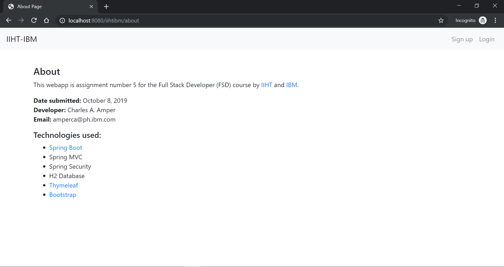
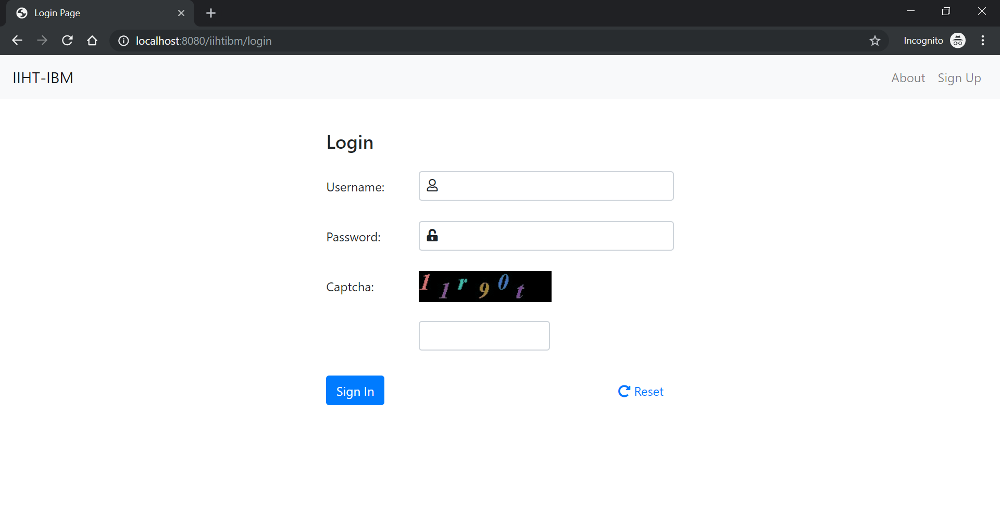
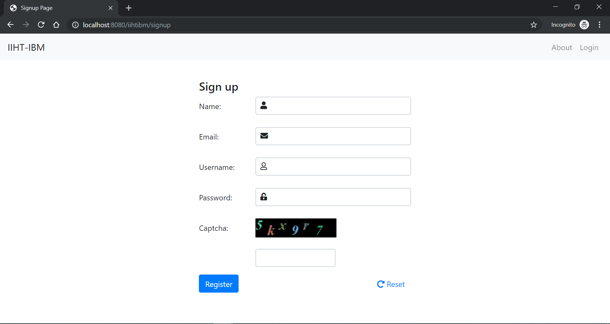
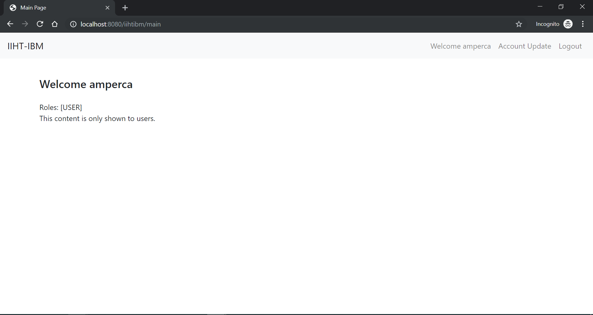
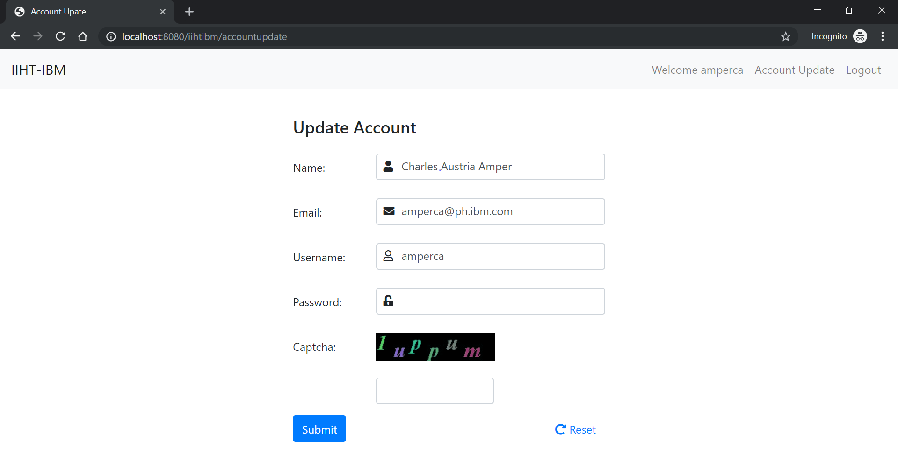
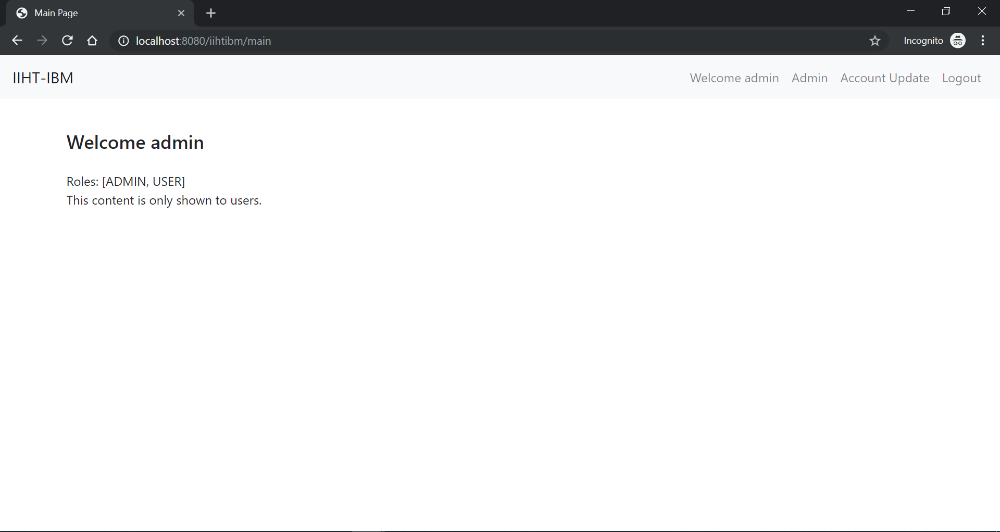
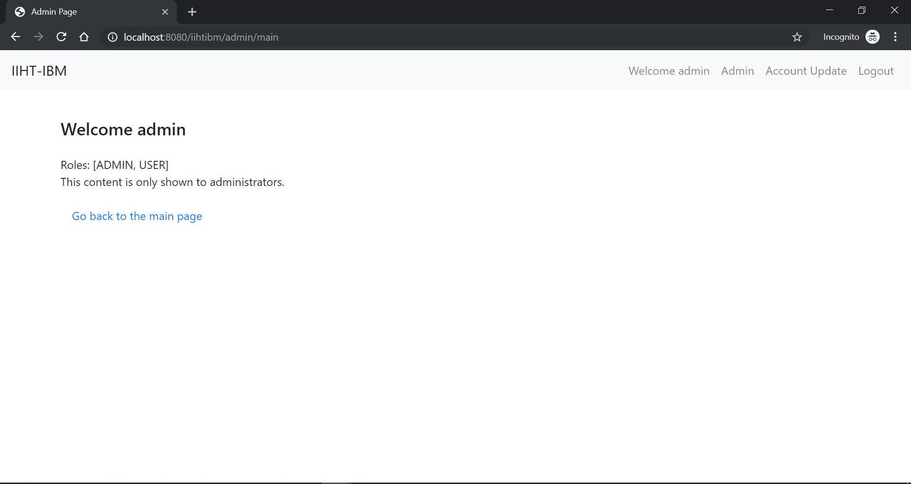
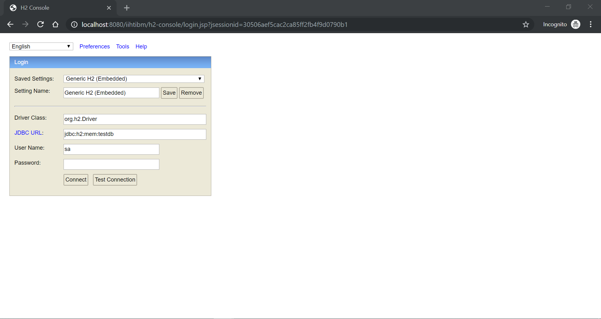

# About

This webapp is assignment number 6 for the Full Stack Developer (FSD) course by IIHT and IBM.

## Built With
* [Spring Framework](https://spring.io/projects/spring-framework)
* [Spring Boot v2.1.8.RELEASE](https://spring.io/projects/spring-boot)
* [Boostrap 4](https://https://getbootstrap.com)
* [h2 Database Engine](https://www.h2database.com)

## Author
* **Charles Amper**

* **Date submitted** : October 8, 2019
* **Training date** : December 2018 - ongoing

## Installing
### prerequisite

Apache Maven

```
Apache Maven 3.6.0 (97c98ec64a1fdfee7767ce5ffb20918da4f719f3; 2018-10-25T02:41:47+08:00)
Maven home: C:\dev\installed\apache-maven-3.6.0
Java version: 1.8.0_201, vendor: Oracle Corporation, runtime: C:\dev\jdk1.8\jre
Default locale: en_PH, platform encoding: Cp1252
OS name: "windows 10", version: "10.0", arch: "amd64", family: "windows"

```

Java 

```
java version "1.8.0_201"
Java(TM) SE Runtime Environment (build 1.8.0_201-b09)
Java HotSpot(TM) 64-Bit Server VM (build 25.201-b09, mixed mode)

```


### Steps

1. Run
```
  git clone https://github.com/talbhoggs/iiht-ibm-training5.git
```
2. In the root folder in step 1 run 

Option 1:
```
  mvn spring-boot-run
```


Option 2:

Run:
```
  mvn package
```

```
cd target

java -jar iihtibm-0.0.1-SNAPSHOT.jar  
```


3. Run this by opening your favorite web browser.

 ```
   http://localhost:8080/iihtibm
 ```

**Congratulations your done!**

## Predefine Users

Admin:
Username : admin
Password : admin

User:
Username : amperca
Password : asdf

## Screenshots

### About page


### Login page


### Signup page


### Main page


### Account update page


### Admin user page


### Admin page


### H2 console page



